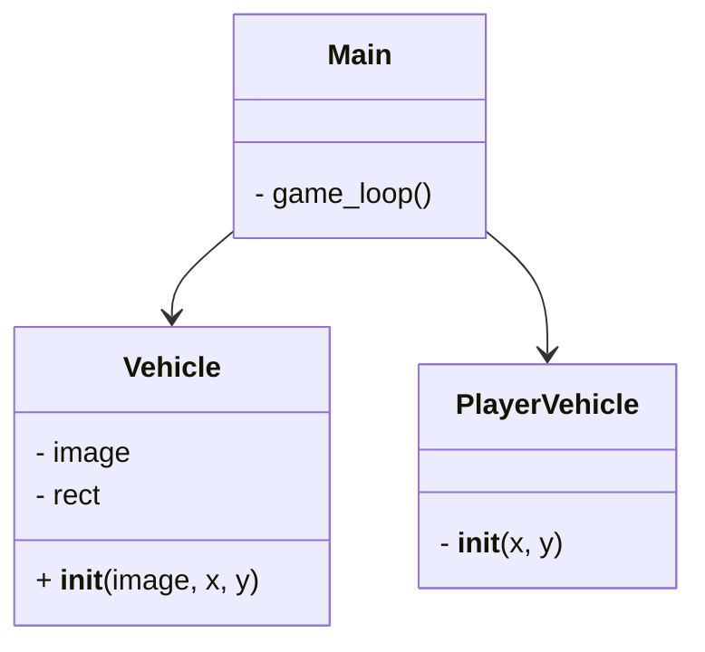

# class Diagram

```mermaid

classDiagram
    class Vehicle {
        - image
        - rect
        + __init__(image, x, y)
    }
    class PlayerVehicle {
        - __init__(x, y)
    }
    class Main {
        - game_loop()
    }

    Main --> Vehicle
    Main --> PlayerVehicle

```