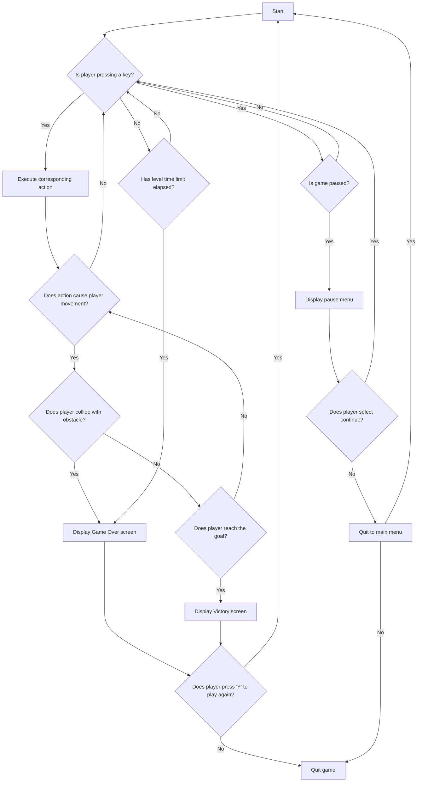
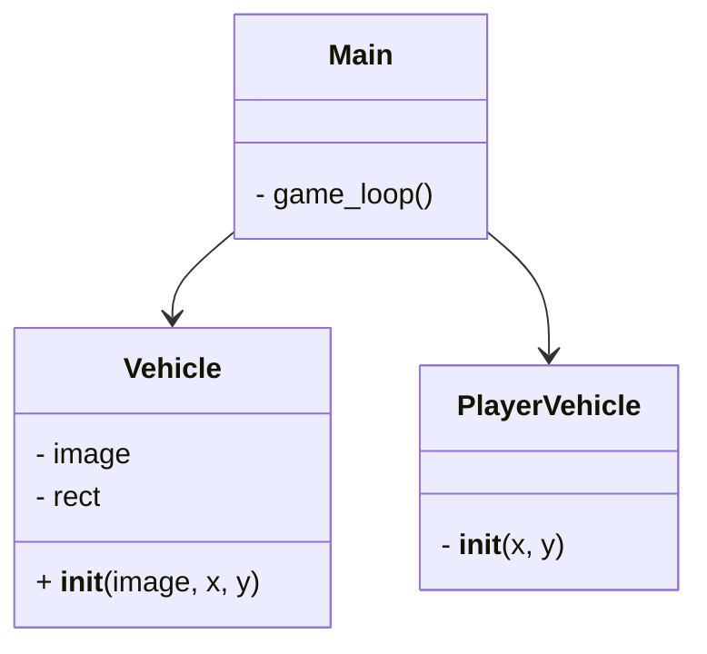
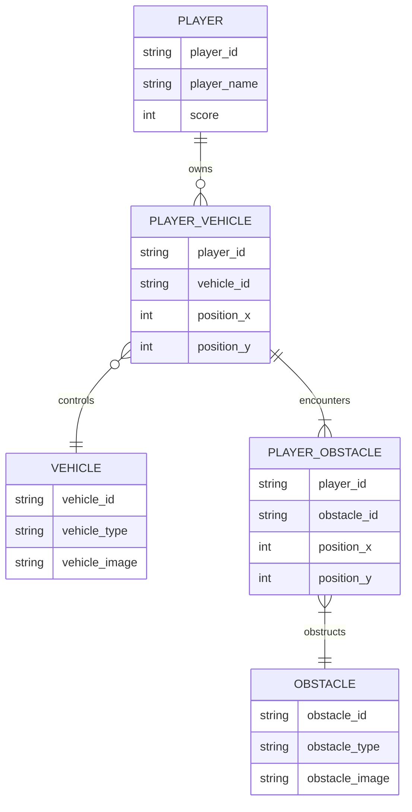
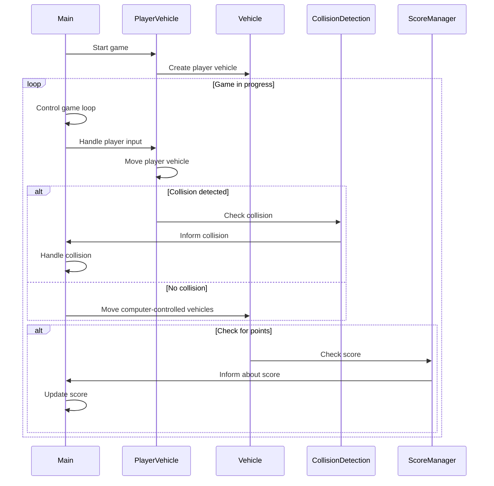

# Documentation of my code

# Introduction

The "Car Game" is an exciting racing game created by Jonatan Novoa using the Python programming language and the Pygame library. Immerse yourself in an experience full of speed, challenges, and adrenaline as you make your way through a busy highway teeming with moving vehicles.

In this game, you take on the role of a fearless driver navigating the bustling city streets in your speedy car. Your goal is to dodge oncoming vehicles as you progress along the road, accumulating points and testing your driving skills.

Get ready to face an increasingly challenging ordeal as the speed ramps up and vehicles become more numerous. Do you have what it takes to go as far as possible and claim your spot at the top of the leaderboard?

Strap yourself in, fire up the engine, and get ready for an exhilarating race in the "Car Game By Jonatan Novoa"!

# Code Structure

1. Main Script (juego.py):

- This script serves as the entry point of the game.
- It initializes the Pygame engine, sets up the game window, and handles the game loop.
- Responsible for managing events, updating game logic, drawing game elements, and checking for collisions.
- Imports the PlayerVehicle and Vehicle classes from separate files.
- Contains the main loop that runs the game.
  
2. PlayerVehicle Class (PlayerVehicle.py):

- Represents the player-controlled vehicle in the game.
- Inherits from the Vehicle class.
- Initializes the player's vehicle with its image and initial position.
- Handles movement of the player's vehicle based on user input.

3. Vehicle Class (Vehicle.py):

- Represents non-player vehicles in the game.
- Initialized with a random image and initial position.
- Handles movement of vehicles across the screen.
- Detects collisions with the player's vehicle.

4. Other Files:

- The game might include additional files for images, sounds, or other resources used in the game.

# Main Classes

1. juego.py:

- This class represents the main script of the game.
- It initializes the Pygame engine, sets up the game window, and manages the game loop.
- Handles events, updates game logic, draws game elements, and checks for collisions.
- Contains the main loop that runs the game.
  
2. PlayerVehicle (defined in PlayerVehicle.py):

- Represents the player-controlled vehicle in the game.
- Inherits from the Vehicle class.
- Initializes the player's vehicle with its image and initial position.
- Manages movement of the player's vehicle based on user input.
  
3. Vehicle (defined in Vehicle.py):

- Represents non-player vehicles in the game.
- Initialized with a random image and initial position.
- Manages movement of vehicles across the screen.
- Detects collisions with the player's vehicle.

# Game Operation 

1. Initialization:

- The game initializes by launching the main script (juego.py).
- Pygame engine is initialized, and the game window is set up.
- Necessary resources like images and sounds are loaded.
  
2. Game Loop:

- The main game loop begins, continuously running until the game is exited.
- Within the loop, events such as user inputs are handled.
- Game logic is updated, including the movement of vehicles and detection of collisions.
- Game elements are redrawn on the screen to reflect the updated state.
  
3. Player Interaction:

- The player controls their vehicle using keyboard input (left and right arrow keys).
- The player's vehicle moves horizontally within predefined lanes on the road.
  
4. Vehicle Movement:

- Non-player vehicles are generated and move vertically downward on the screen at varying speeds.
- New vehicles are added to the game to maintain a constant flow of traffic.
- Vehicles are removed from the game when they move beyond the screen.
  
5. Collision Detection:

 - Collision detection is performed between the player's vehicle and other vehicles on the road.
 - If a collision occurs, the game ends, and a "Game Over" message is displayed.
   
6. Scoring:

- The player earns points as they successfully navigate through the traffic without colliding with other vehicles.
- The game speed increases periodically or based on the player's score to ramp up the difficulty.
  
7. Game Over:

- When a collision occurs or the player chooses to quit the game, the game over sequence is initiated.
- The final score is displayed, along with an option to restart the game.
  
8. Restart:

The player can choose to restart the game by pressing a designated key (typically 'Y' or 'N') when prompted.
If the player chooses to restart, the game resets, and the main loop continues from the beginning.

# Conclusion

The "Car Game By Jonatan Novoa" delivers an engaging and challenging gaming experience. With its fast-paced gameplay, intuitive controls, and progressively increasing difficulty, players are drawn into an immersive world of traffic navigation. Interactive features like collision detection and scoring system add depth to the gameplay, while the user-friendly interface ensures accessibility for players of all skill levels. Overall, the game showcases creativity and innovation in design, offering hours of entertainment for gaming enthusiasts.

# Data Dictioonary

In the context of the "Car Game By Jonatan Novoa," a data dictionary might include the following:

1. PlayerVehicle Class:

- "image": Represents the image of the player-controlled vehicle.
rect: Represents the rectangular area occupied by the player's vehicle on the screen.
x: Represents the x-coordinate of the player's vehicle.
y: Represents the y-coordinate of the player's vehicle.
Vehicle Class:

image: Represents the image of a non-player vehicle.
rect: Represents the rectangular area occupied by a non-player vehicle on the screen.
x: Represents the x-coordinate of a non-player vehicle.
y: Represents the y-coordinate of a non-player vehicle.
speed: Represents the speed of a non-player vehicle.
score: Represents the player's score in the game.
Main Script (juego.py):

width: Represents the width of the game window.
height: Represents the height of the game window.
screen: Represents the Pygame display surface.
player_group: Represents the group containing the player's vehicle sprite.
vehicle_group: Represents the group containing non-player vehicle sprites.
clock: Represents the Pygame clock object for managing frame rate.
fps: Represents the target frames per second for the game.
gameover: Represents the flag indicating whether the game is over.
running: Represents the flag indicating whether the game is running.

# Flowchart

# Class Diagram

# Class identidad relacion 

# Diagram of sequence

