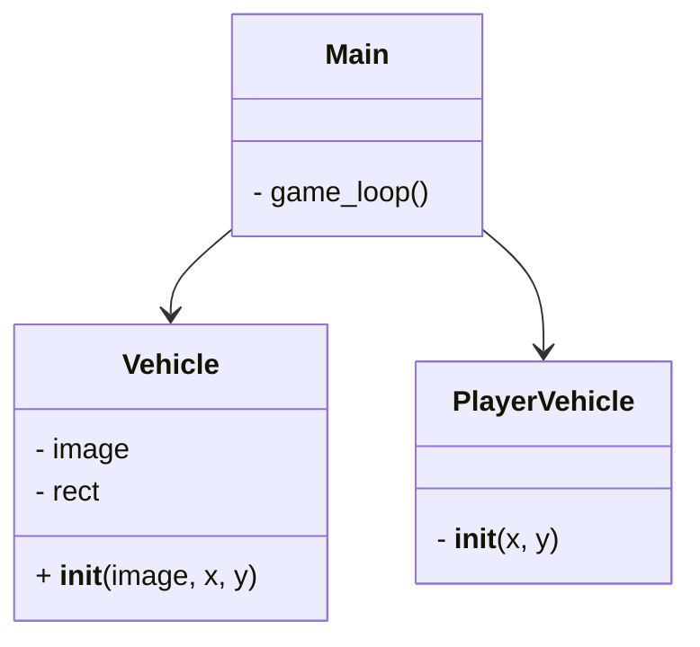
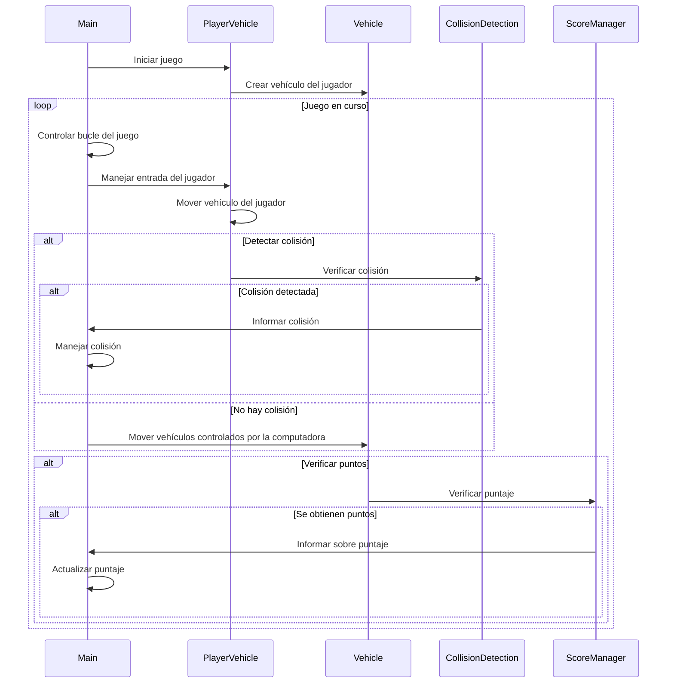
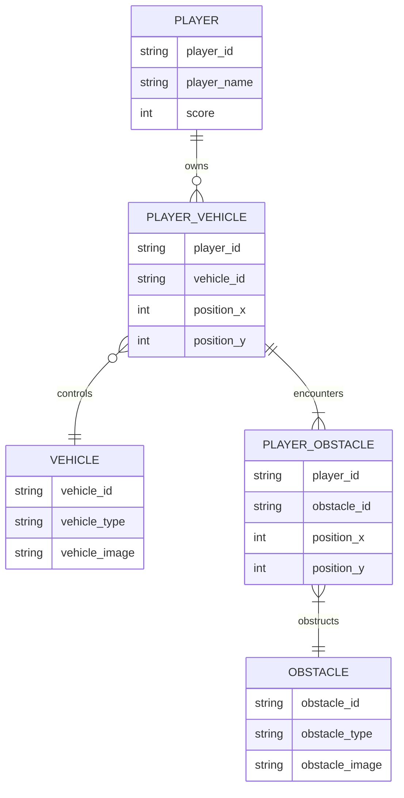
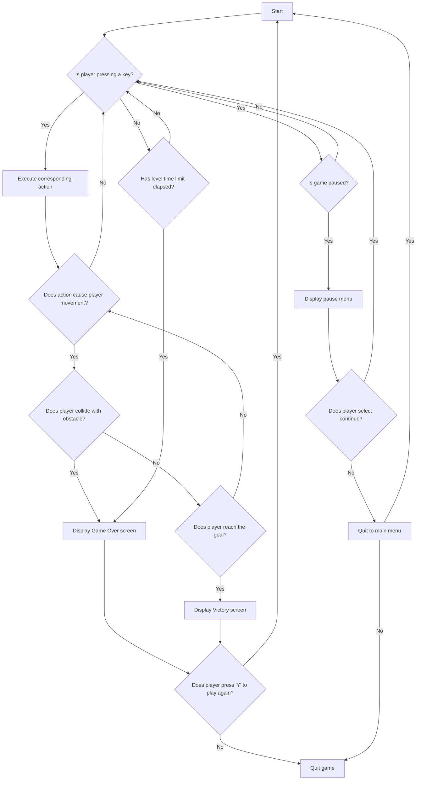

# class Diagram

```mermaid

classDiagram
    class Vehicle {
        - image
        - rect
        + __init__(image, x, y)
    }
    class PlayerVehicle {
        - __init__(x, y)
    }
    class Main {
        - game_loop()
    }

    Main --> Vehicle
    Main --> PlayerVehicle

```

# Class de secuencia 

```mermaid
sequenceDiagram
    participant Main
    participant PlayerVehicle
    participant Vehicle
    participant CollisionDetection
    participant ScoreManager

    Main ->> PlayerVehicle: Iniciar juego
    PlayerVehicle ->> Vehicle: Crear vehículo del jugador
    loop Juego en curso
        Main ->> Main: Controlar bucle del juego
        Main ->> PlayerVehicle: Manejar entrada del jugador
        PlayerVehicle ->> PlayerVehicle: Mover vehículo del jugador

        alt Detectar colisión
            PlayerVehicle ->> CollisionDetection: Verificar colisión
            alt Colisión detectada
                CollisionDetection ->> Main: Informar colisión
                Main ->> Main: Manejar colisión
            end
        else No hay colisión
            Main ->> Vehicle: Mover vehículos controlados por la computadora
        end

        alt Verificar puntos
            Vehicle ->> ScoreManager: Verificar puntaje
            alt Se obtienen puntos
                ScoreManager ->> Main: Informar sobre puntaje
                Main ->> Main: Actualizar puntaje
            end
        end
    end
```

# Class identidad relacion 

```mermaid
erDiagram
    PLAYER {
        string player_id
        string player_name
        int score
    }
    VEHICLE {
        string vehicle_id
        string vehicle_type
        string vehicle_image
    }
    PLAYER_VEHICLE {
        string player_id
        string vehicle_id
        int position_x
        int position_y
    }
    OBSTACLE {
        string obstacle_id
        string obstacle_type
        string obstacle_image
    }
    PLAYER_OBSTACLE {
        string player_id
        string obstacle_id
        int position_x
        int position_y
    }

    PLAYER ||--o{ PLAYER_VEHICLE : owns
    PLAYER_VEHICLE }o--|| VEHICLE : controls
    PLAYER_VEHICLE ||--|{ PLAYER_OBSTACLE : encounters
    PLAYER_OBSTACLE }|--|| OBSTACLE : obstructs

```

# Diagrama de flujo 

```mermaid
graph TD;
    A[Start] --> B{Is player pressing a key?};
    B -->|Yes| C[Execute corresponding action];
    C --> D{Does action cause player movement?};
    D -->|Yes| E{Does player collide with obstacle?};
    E -->|Yes| F[Display Game Over screen];
    F --> G{Does player press 'Y' to play again?};
    G -->|Yes| A;
    G -->|No| H[Quit game];
    E -->|No| I{Does player reach the goal?};
    I -->|Yes| J[Display Victory screen];
    J --> G;
    I -->|No| D;
    D -->|No| B;
    B -->|No| K{Has level time limit elapsed?};
    K -->|Yes| F;
    K -->|No| B;
    B -->|Yes| L{Is game paused?};
    L -->|Yes| M[Display pause menu];
    L -->|No| B;
    M --> N{Does player select continue?};
    N -->|Yes| B;
    N -->|No| O[Quit to main menu];
    O -->|Yes| A;
    O -->|No| H;

```