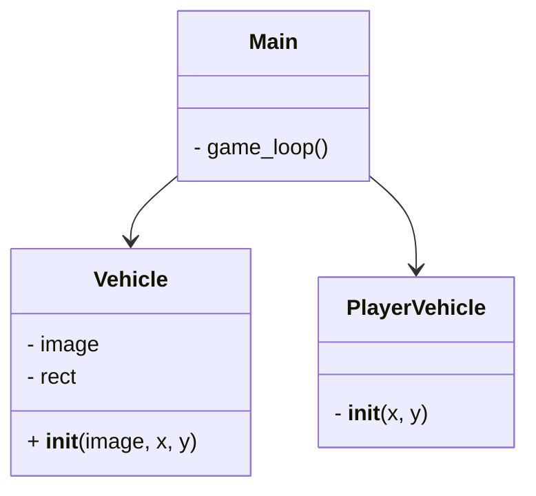
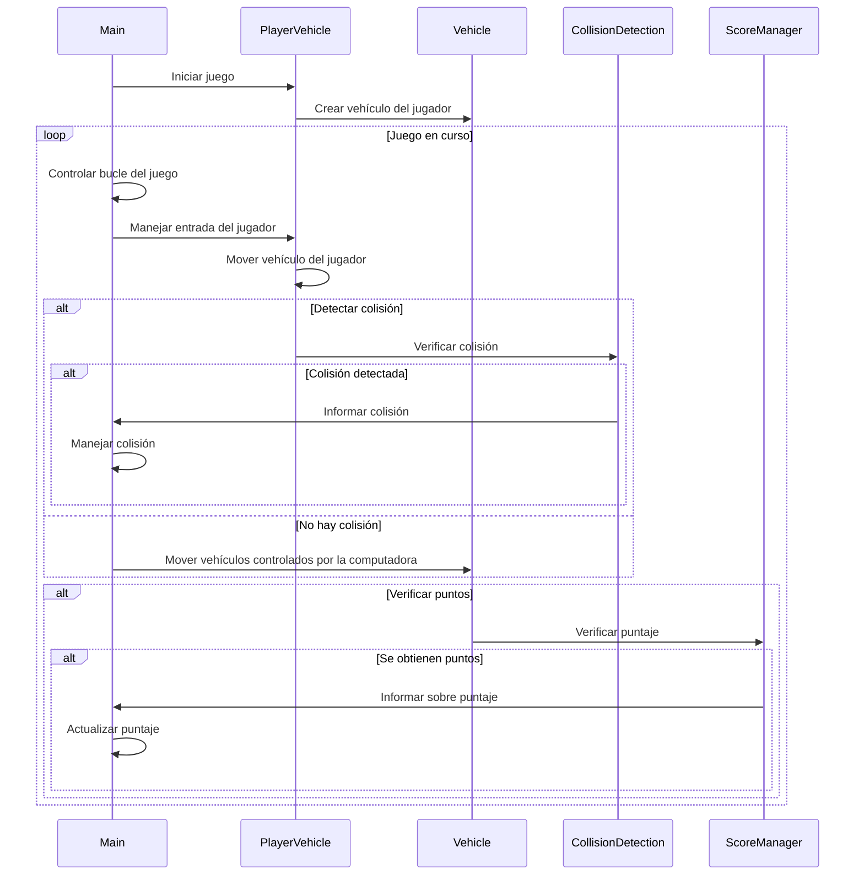

# class Diagram

```mermaid

classDiagram
    class Vehicle {
        - image
        - rect
        + __init__(image, x, y)
    }
    class PlayerVehicle {
        - __init__(x, y)
    }
    class Main {
        - game_loop()
    }

    Main --> Vehicle
    Main --> PlayerVehicle

```

# Class de secuencia 

```mermaid
sequenceDiagram
    participant Main
    participant PlayerVehicle
    participant Vehicle
    participant CollisionDetection
    participant ScoreManager

    Main ->> PlayerVehicle: Iniciar juego
    PlayerVehicle ->> Vehicle: Crear vehículo del jugador
    loop Juego en curso
        Main ->> Main: Controlar bucle del juego
        Main ->> PlayerVehicle: Manejar entrada del jugador
        PlayerVehicle ->> PlayerVehicle: Mover vehículo del jugador

        alt Detectar colisión
            PlayerVehicle ->> CollisionDetection: Verificar colisión
            alt Colisión detectada
                CollisionDetection ->> Main: Informar colisión
                Main ->> Main: Manejar colisión
            end
        else No hay colisión
            Main ->> Vehicle: Mover vehículos controlados por la computadora
        end

        alt Verificar puntos
            Vehicle ->> ScoreManager: Verificar puntaje
            alt Se obtienen puntos
                ScoreManager ->> Main: Informar sobre puntaje
                Main ->> Main: Actualizar puntaje
            end
        end
    end
```