# Documentation of my code

# Introduction

The "Car Game" is an exciting racing game created by Jonatan Novoa using the Python programming language and the Pygame library. Immerse yourself in an experience full of speed, challenges, and adrenaline as you make your way through a busy highway teeming with moving vehicles.

In this game, you take on the role of a fearless driver navigating the bustling city streets in your speedy car. Your goal is to dodge oncoming vehicles as you progress along the road, accumulating points and testing your driving skills.

Get ready to face an increasingly challenging ordeal as the speed ramps up and vehicles become more numerous. Do you have what it takes to go as far as possible and claim your spot at the top of the leaderboard?

Strap yourself in, fire up the engine, and get ready for an exhilarating race in the "Car Game By Jonatan Novoa"!

# Flowchart

# Class Diagram

# Class identidad relacion 

```mermaid
erDiagram
    PLAYER {
        string player_id
        string player_name
        int score
    }
    VEHICLE {
        string vehicle_id
        string vehicle_type
        string vehicle_image
    }
    PLAYER_VEHICLE {
        string player_id
        string vehicle_id
        int position_x
        int position_y
    }
    OBSTACLE {
        string obstacle_id
        string obstacle_type
        string obstacle_image
    }
    PLAYER_OBSTACLE {
        string player_id
        string obstacle_id
        int position_x
        int position_y
    }

    PLAYER ||--o{ PLAYER_VEHICLE : owns
    PLAYER_VEHICLE }o--|| VEHICLE : controls
    PLAYER_VEHICLE ||--|{ PLAYER_OBSTACLE : encounters
    PLAYER_OBSTACLE }|--|| OBSTACLE : obstructs
```

# Diagram of sequence

