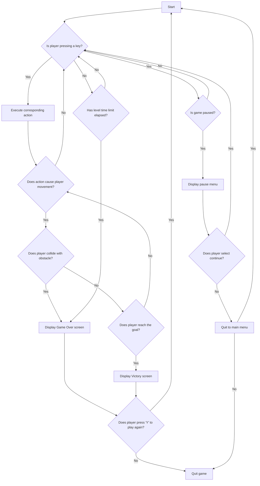
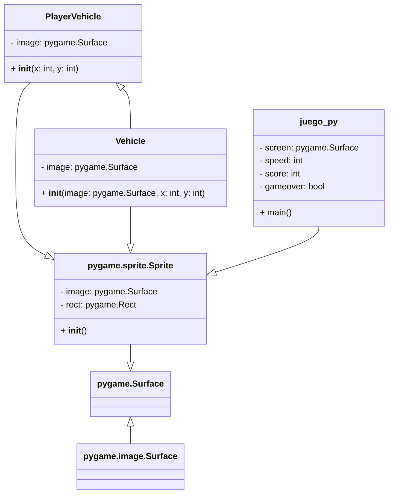
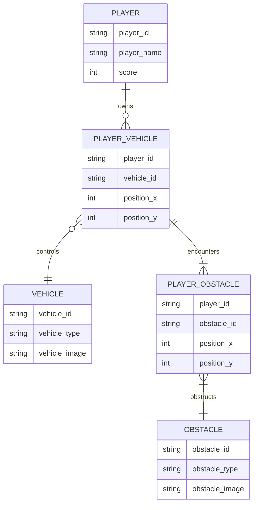
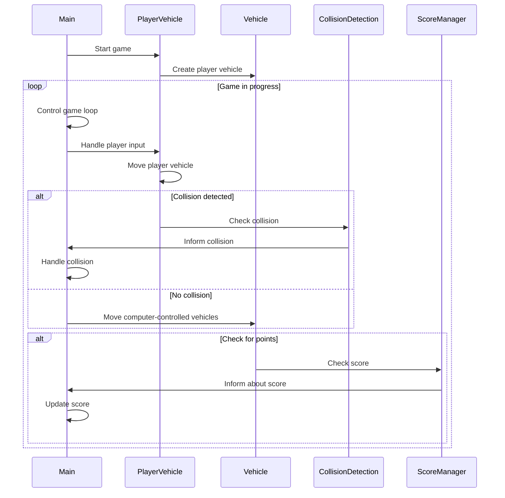

# Flowchart

```mermaid
graph TD;
    A[Start] --> B{Is player pressing a key?};
    B -->|Yes| C[Execute corresponding action];
    C --> D{Does action cause player movement?};
    D -->|Yes| E{Does player collide with obstacle?};
    E -->|Yes| F[Display Game Over screen];
    F --> G{Does player press 'Y' to play again?};
    G -->|Yes| A;
    G -->|No| H[Quit game];
    E -->|No| I{Does player reach the goal?};
    I -->|Yes| J[Display Victory screen];
    J --> G;
    I -->|No| D;
    D -->|No| B;
    B -->|No| K{Has level time limit elapsed?};
    K -->|Yes| F;
    K -->|No| B;
    B -->|Yes| L{Is game paused?};
    L -->|Yes| M[Display pause menu];
    L -->|No| B;
    M --> N{Does player select continue?};
    N -->|Yes| B;
    N -->|No| O[Quit to main menu];
    O -->|Yes| A;
    O -->|No| H;

```
# Class Diagram

```mermaid
classDiagram
    class PlayerVehicle {
        - image: pygame.Surface
        + __init__(x: int, y: int)
    }
    class Vehicle {
        - image: pygame.Surface
        + __init__(image: pygame.Surface, x: int, y: int)
    }
    class juego_py {
        - screen: pygame.Surface
        - speed: int
        - score: int
        - gameover: bool
        + main()
    }
    class pygame.Surface
    class pygame.image.Surface
    class pygame.sprite.Sprite {
        - image: pygame.Surface
        - rect: pygame.Rect
        + __init__()
    }

    PlayerVehicle <|-- Vehicle
    PlayerVehicle --|> pygame.sprite.Sprite
    Vehicle --|> pygame.sprite.Sprite
    juego_py --|> pygame.sprite.Sprite
    pygame.sprite.Sprite --|> pygame.Surface
    pygame.Surface <|-- pygame.image.Surface
```
# Class identidad relacion 

```mermaid
erDiagram
    PLAYER {
        string player_id
        string player_name
        int score
    }
    VEHICLE {
        string vehicle_id
        string vehicle_type
        string vehicle_image
    }
    PLAYER_VEHICLE {
        string player_id
        string vehicle_id
        int position_x
        int position_y
    }
    OBSTACLE {
        string obstacle_id
        string obstacle_type
        string obstacle_image
    }
    PLAYER_OBSTACLE {
        string player_id
        string obstacle_id
        int position_x
        int position_y
    }

    PLAYER ||--o{ PLAYER_VEHICLE : owns
    PLAYER_VEHICLE }o--|| VEHICLE : controls
    PLAYER_VEHICLE ||--|{ PLAYER_OBSTACLE : encounters
    PLAYER_OBSTACLE }|--|| OBSTACLE : obstructs
```

# Diagram of sequence

```mermaid
sequenceDiagram
    participant Main
    participant PlayerVehicle
    participant Vehicle
    participant CollisionDetection
    participant ScoreManager

    Main ->> PlayerVehicle: Start game
    PlayerVehicle ->> Vehicle: Create player vehicle
    loop Game in progress
        Main ->> Main: Control game loop
        Main ->> PlayerVehicle: Handle player input
        PlayerVehicle ->> PlayerVehicle: Move player vehicle

        alt Collision detected
            PlayerVehicle ->> CollisionDetection: Check collision
            CollisionDetection ->> Main: Inform collision
            Main ->> Main: Handle collision
        else No collision
            Main ->> Vehicle: Move computer-controlled vehicles
        end

        alt Check for points
            Vehicle ->> ScoreManager: Check score
            ScoreManager ->> Main: Inform about score
            Main ->> Main: Update score
        end
    end
```

